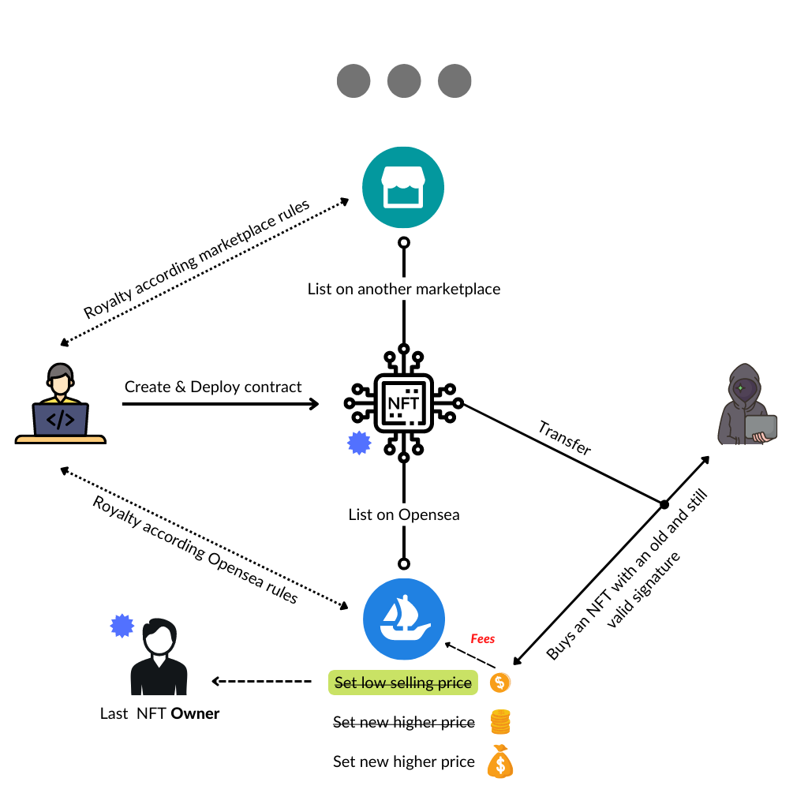
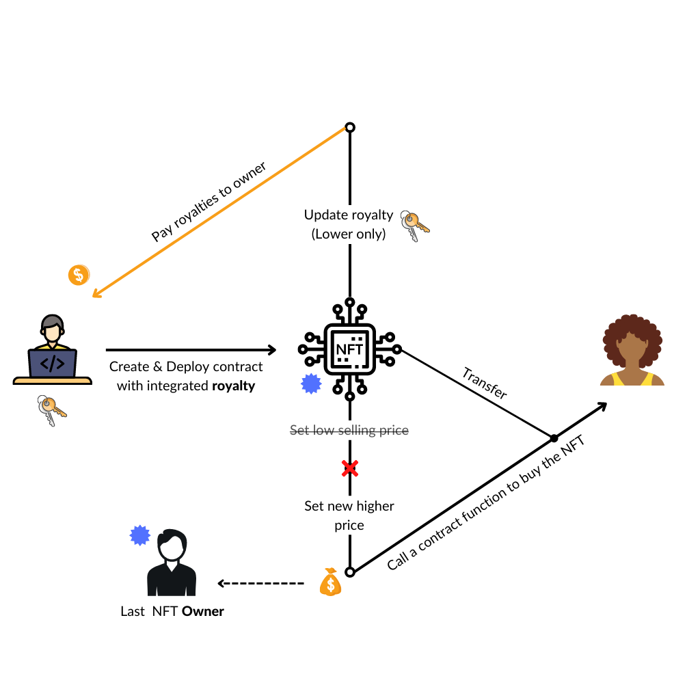

# <h1 align="center"> ⛓️ Buyable ERC721 Standard ⛓️ </h1>

_To understand the use of this repository please read **[eip-6260.md](eip-6260.md)**. The main solidity files are [ERC721Buyable.sol](./contracts/ERC721Buyable.sol) and its interface [IERC721Buyable.sol](./contracts/interfaces/IERC721Buyable.sol), the other contracts are here for tests and integration demonstration._

&nbsp;

<p align="center"> 
   
</p>

---

1. [Presentation](#presentation)
2. [Installation Guide](#guide)
   1. [Dependencies](#dependencies)
   2. [Tests](#tests)
   3. [Deployment](#deployment)
      1. [Locally](#locally)
      2. [Testnet](#testnet)
3. [Dapp](#dapp)

# Presentation <a name="presentation"></a>

Following numerous hacks last year where NFTs were stolen from major platforms (i.e Opensea), we thought of **integrating the NFT trading system directly on the blockchain, within the smart contract**. The main reason these hacks occurred was due to some platforms storing order signatures off-chain, inside their API. This allowed hackers to create a loophole, changing the NFT prices and effectively buying the pieces for a lower amount than their original price. The NFT trading system we thought about would allow total independence, as the user would be able to trade his NFT at any point, without relying on a marketplace. Using this system, it would also make total sense to create a standard which would guarantee royalties are correctly enforced (through the blockchain), as long as the sale or purchase follows this specific method.

As of now, we expect marketplaces to voluntarily pay royalties “off-chain”. But this process is not yet widely adopted and relies on the marketplace being trustworthy. We have created an improvement proposal that **automatically calculates & pays royalties on-chain for every token sold: [EIP](./EIP-ERC721Buyable.md).** On top of that, our improvement proposal allows the ERC-721 token to be financially tradeable in ETH on-chain without the need for marketplaces and the issues that comes with them: security, royalties not respected or limited.

Whilst we are aware the code could be improved, we wanted to share the idea here on this forum. We greatly appreciate any pull requests aiming to optimise gas fees.

 

Additionally, we are conscious this improvement model by itself is only one brick to guarantee royalty-enforcement, simply because it does not stop the users from going on other marketplaces which may not enforce them (e.g. sudoswap, which attracted a lot of attention lately).

Therefore, the NFT smart contract may be abe to inherit from the Operator Filter Registry put in place by Opensea, allowing creators to blacklist marketplaces which do not enforce royalties. Alternatives may include Blur.io’s DefaultOperatorFilter solution ([see here](https://github.com/blur-io/operator-filter-registry)), or Vectorized’s ClosedSea for a gas-efficient solution ([see here](https://github.com/Vectorized/closedsea)).

Getting back to our improvement proposal, we build a decentralised NFT marketplace, fully hosted in a decentralized way in order to show and explain in its simplest way possible how our solution could be used: https://erc721buyable.app.runonflux.io/.

_NB: As of now, this solution only works with NFTs stored on-chain, for demonstration purposes._

We truly believe this decentralised marketplace model could be of interest for users who may prefer full control over their holdings / creations, and may not trust third-party intermediaries such as Marketplaces.

# Installation Guide <a name="guide"></a>

## Dependencies <a name="dependencies"></a>

Install the dependencies and devDependencies.

```sh
npm install
# or
npm i
```

## Tests <a name="tests"></a>

To run tests enter :

```sh
npx hardhat test
#or
npx hardhat test .\test\buyableTokenTest.js
```

## Deployment <a name="deployment"></a>

In [deploy.js](deploy.js) `await contract.mint();` can be removed as it is just a way for us to interact with the blockchain right within the script without having to do it manually after.

To deploy a contract other than "NFTContract" one can just specify and create another instance of `getContractFactory` and repeat the next steps.

### Locally <a name="locally"></a>

To deploy locally you can just write `npx hardhat run scripts/deploy.js`

### Testnet <a name="testnet"></a>

To deploy on a testnet like _goerli_ you need to write the following command `npx hardhat run scripts/deploy.js --network goerli` after setting up the network and other configurations in the [hardhat.config.js](hardhat.config.js) file.

For that you wil need to fill a [.env]() file with an api url key and a private key.

```sh
API_URL="https://eth-goerli.g.alchemy.com/XXXXX"
PRIVATE_KEY="0xXXX...XXX"
```

- The `API_URL` enables you to connect to the blockchain through a node given by your provider, the best-known ones are [Infura](https://infura.io/) and [Alchemy](https://www.alchemy.com/) and you can get your api url key there.
- The `PRIVATE_KEY` is associated with you blockchain wallet, the most famous one is [Metamask](https://metamask.io/) and can be installed as a browser extension. From there after setting up your wallet you should be able to export your private key in _account details_.

Now [hardhat.config.js](hardhat.config.js) should have these lines where it imports the _.env_ variables. The `module.exports` is best set as follow with your solidity version compiler.

```js
require("@nomicfoundation/hardhat-toolbox");
require("dotenv").config();

const ETHERSCAN_KEY = process.env.ETHERSCAN_KEY;

const GOERLI_API_URL = process.env.GOERLI_API_URL;
const GOERLI_PRIVATE_KEY = process.env.GOERLI_PRIVATE_KEY;

module.exports = {
  solidity: {
    version: "0.8.16",
    settings: {
      optimizer: {
        enabled: true,
        runs: 200,
      },
    },
  },
  networks: {
    hardhat: {},
    goerli: {
      url: GOERLI_API_URL,
      accounts: [GOERLI_PRIVATE_KEY],
    },
  },
  etherscan: {
    apiKey: ETHERSCAN_KEY,
  },
  // paths: {
  //   artifacts: './client/src/artifacts'
  // },
  gasReporter: {
    enabled: true,
    currency: "USD",
    gasPrice: 21,
  },
};
```

_\* Before deploying and using any network make sure you have ETH in you wallet to pay for the transactions fees._

# Dapp <a name="dapp"></a>

The [_client_](./client/) folder is a react application that provides a minimal **demonstration** of how this ERC can be integrated into marketplaces but without the need for an intermediate smart contract: a **decentralized marketplace** can be built around this interface but centralized ones can still integrate it. It also includes an interface for the owner of a token allowing him to put it up for sale at any price or remove it, and for the owner of the contract to update the royalty rate.
